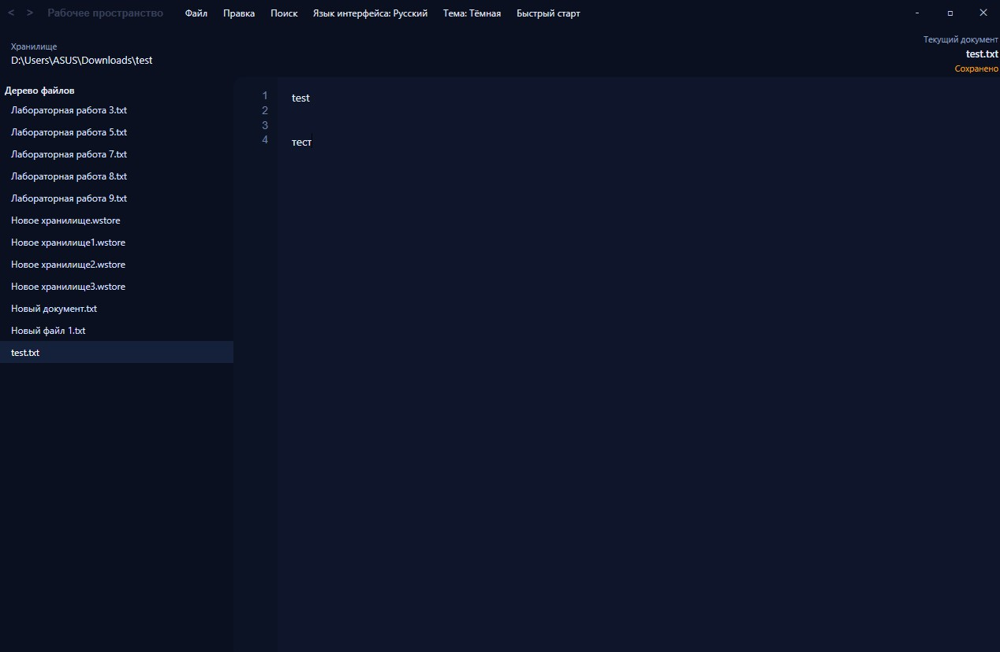
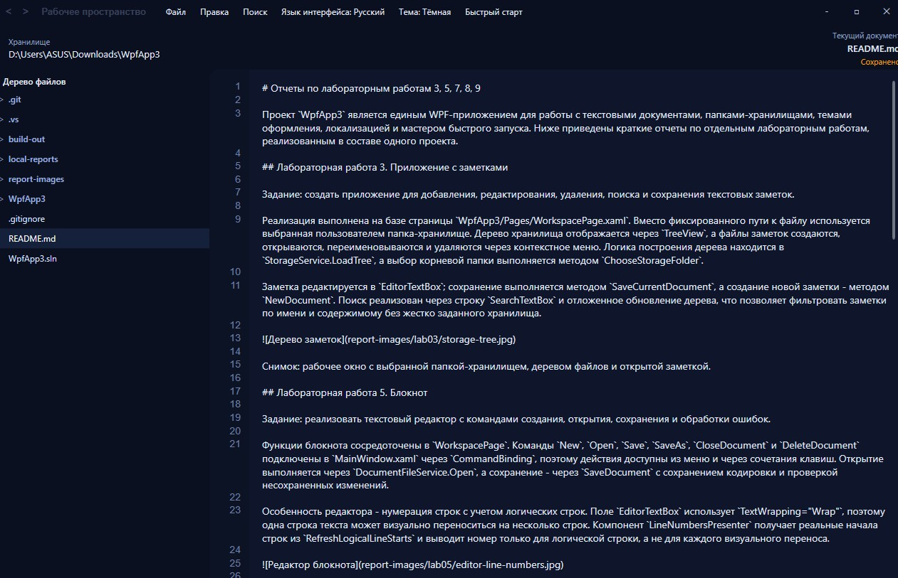
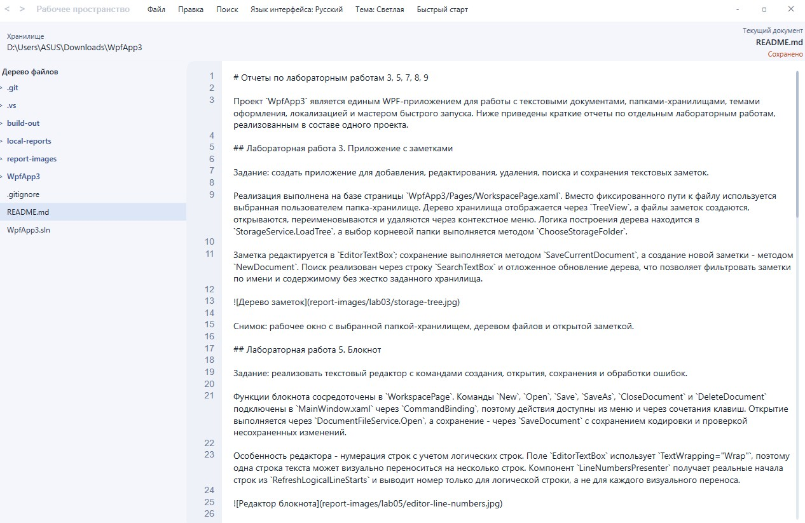
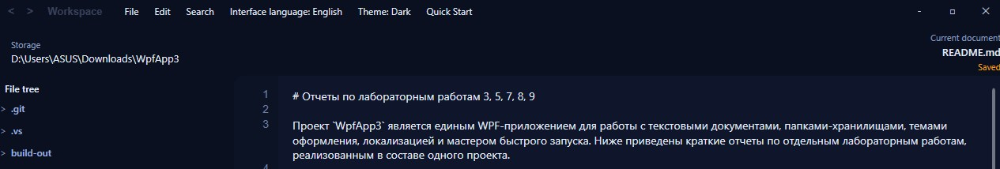
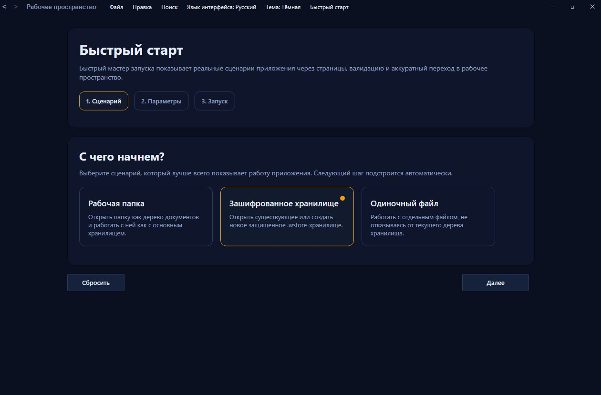
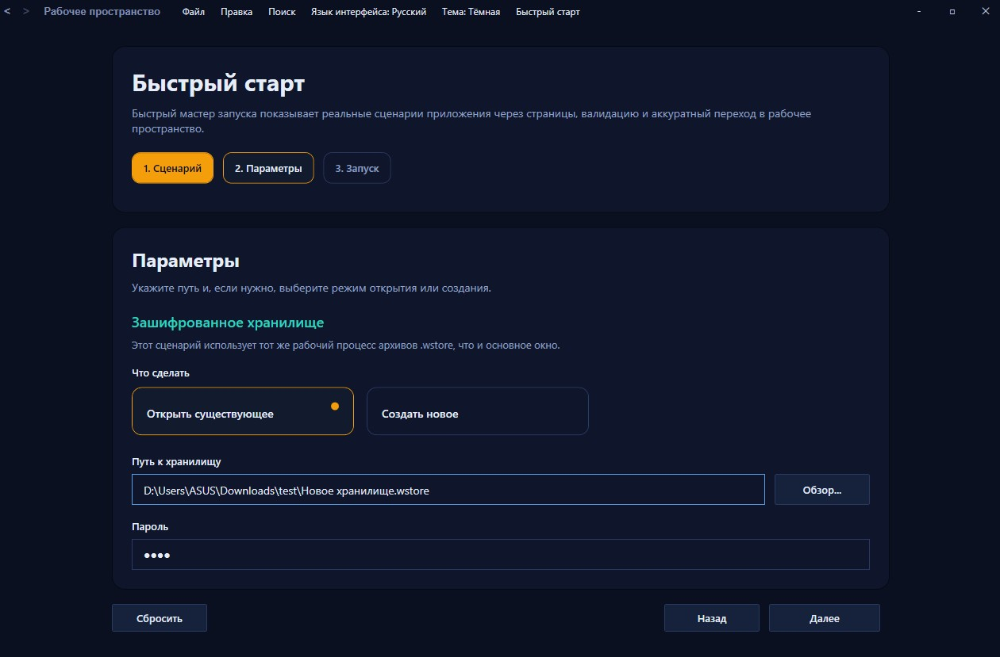
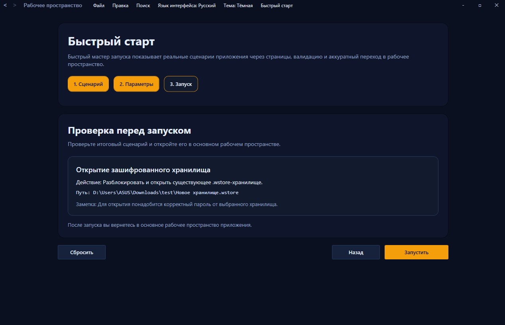

# Отчеты по лабораторным работам 3, 5, 7, 8, 9

Проект `WpfApp3` является единым WPF-приложением для работы с текстовыми документами, папками-хранилищами, темами оформления, локализацией и мастером быстрого запуска. Ниже приведены краткие отчеты по отдельным лабораторным работам, реализованным в составе одного проекта.

## Лабораторная работа 3. Приложение с заметками

Задание: создать приложение для добавления, редактирования, удаления, поиска и сохранения текстовых заметок.

Реализация выполнена на базе страницы `WpfApp3/Pages/WorkspacePage.xaml`. Вместо фиксированного пути к файлу используется выбранная пользователем папка-хранилище. Дерево хранилища отображается через `TreeView`, а файлы заметок создаются, открываются, переименовываются и удаляются через контекстное меню. Логика построения дерева находится в `StorageService.LoadTree`, а выбор корневой папки выполняется методом `ChooseStorageFolder`.

Заметка редактируется в `EditorTextBox`; сохранение выполняется методом `SaveCurrentDocument`, а создание новой заметки - методом `NewDocument`. Поиск реализован через строку `SearchTextBox` и отложенное обновление дерева, что позволяет фильтровать заметки по имени и содержимому без жестко заданного хранилища.

Снимок: рабочее окно с выбранной папкой-хранилищем, деревом файлов и открытой заметкой.

Снимок: фрагменты `WorkspacePage.ChooseStorageFolder`, `WorkspacePage.NewDocument`, `StorageService.LoadTree`.

## Лабораторная работа 5. Блокнот

Задание: реализовать текстовый редактор с командами создания, открытия, сохранения и обработки ошибок.

Функции блокнота сосредоточены в `WorkspacePage`. Команды `New`, `Open`, `Save`, `SaveAs`, `CloseDocument` и `DeleteDocument` подключены в `MainWindow.xaml` через `CommandBinding`, поэтому действия доступны из меню и через сочетания клавиш. Открытие выполняется через `DocumentFileService.Open`, а сохранение - через `SaveDocument` с сохранением кодировки и проверкой несохраненных изменений.

Особенность редактора - нумерация строк с учетом логических строк. Поле `EditorTextBox` использует `TextWrapping="Wrap"`, поэтому одна строка текста может визуально переноситься на несколько строк. Компонент `LineNumbersPresenter` получает реальные начала строк из `RefreshLogicalLineStarts` и выводит номер только для логической строки, а не для каждого визуального переноса.

Снимок: открытый документ с длинной строкой, визуальным переносом и корректной нумерацией.

Снимок: фрагменты `SaveDocument`, `RefreshLogicalLineStarts` и `LineNumbersPresenter.OnRender`.

## Лабораторная работа 7. Шаблоны кнопок и элементы оформления

Задание: разработать пользовательские стили и шаблоны кнопок с реакцией на состояния элементов управления.

Базовый шаблон кнопки вынесен в `WpfApp3/ButtonStyles.xaml`. Стиль `BaseAppButtonStyle` определяет `ControlTemplate`, фон, рамку, наложения `HoverOverlay` и `PressedOverlay`. Для наведения используется `Storyboard` с `DoubleAnimation`, а состояния нажатия и отключения обрабатываются триггерами `IsPressed` и `IsEnabled`.

Оформление приложения дополнено светлой и темной темами. Сервис `ThemeService` заменяет активный словарь ресурсов `Theme.Dark.xaml` или `Theme.Light.xaml`, а меню темы в `MainWindow` вызывает `ApplyThemeSelection`. Это позволяет проверять шаблоны кнопок в разных цветовых схемах без изменения разметки страниц.

Снимок: кнопки в обычном состоянии, при наведении и при нажатии.

Снимок: фрагмент `ButtonStyles.xaml` с `ControlTemplate`, триггерами и `DoubleAnimation`.

Снимок: одно и то же окно в светлой и темной теме.

## Лабораторная работа 8. Многоязычный блокнот

Задание: реализовать многоязычный блокнот с динамической сменой языка интерфейса.

Локализация построена на ресурсах `Strings.resx`, `Strings.ru.resx` и `Strings.en.resx`. Сервис `LocalizationService` хранит текущую культуру, находит доступные языки и предоставляет строки интерфейса через индексатор. При выборе языка вызывается `ApplyLanguageSelection`, после чего обновляются меню, страницы `WorkspacePage` и `SettingsPage` без перезапуска приложения.

Блокнот сохраняет основные функции редактора: создание, открытие, сохранение, закрытие документа, поиск и обработку ошибок. Языковое меню показывает текущий язык и варианты RU/EN, а добавление нового языка возможно через новый `.resx`-файл по существующей схеме ресурсов.

Снимок: приложение с русским интерфейсом.

Снимок: то же окно после переключения на английский язык.

Снимок: фрагменты `LocalizationService.SetCulture`, `MainWindow.ApplyLanguageSelection` и `.resx`-ресурсов.

## Лабораторная работа 9. Три страницы, заполнение, валидация и сохранение данных

Задание: реализовать многоступенчатую форму с навигацией между страницами, проверкой введенных данных и передачей результата.

Вместо пользовательской анкеты реализован мастер Quick Start. Он состоит из трех этапов: выбор сценария, ввод параметров, проверка итоговых данных перед запуском. Пользователь выбирает папку-хранилище, зашифрованное `.wstore`-хранилище или отдельный файл, затем выбирает создание нового объекта либо использование существующего.

Интегрированная реализация находится в `HelpPage`: методы `NextButton_Click`, `BackButton_Click`, `ValidateConfiguration`, `UpdateSummary` и `ExecuteScenario` управляют переходами, проверкой данных и запуском выбранного сценария. Для зашифрованных хранилищ используется пароль, подтверждение пароля при создании и методы `CreateEncryptedStorage` или `OpenEncryptedStorage` страницы `WorkspacePage`. Упаковка `.wstore` выполняется через `EncryptedStorageCliService` и Python-скрипт `storage_cli.py`, где применяются Scrypt и AES-GCM. В проекте также присутствует `QuickStartPage` с MVVM-вариантом того же мастера и событием `QuickStartRequested`.

Снимок: первый шаг мастера с выбором сценария.

Снимок: второй шаг с параметрами папки или зашифрованного хранилища.

Снимок: третий шаг с проверкой введенных данных и описанием действия.

Снимок: фрагменты `HelpPage.ValidateConfiguration`, `UpdateSummary`, `ExecuteScenario` и `WorkspacePage.Storage.cs`.
